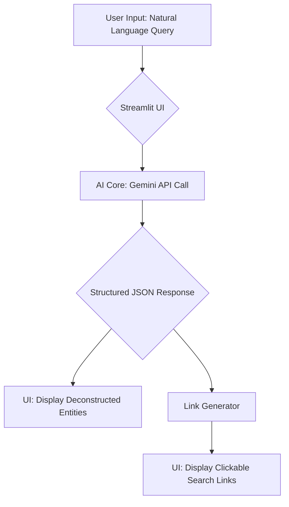

## Introducing SmartSearchSaaSquatch 

A simple, powerful lead-generation tool that uses AI to translate complex, natural language requests into targeted, actionable search queries.

### Key Features
*Natural Language Input* : Users can describe their ideal company profile in plain English.

*AI-Powered Deconstruction* : Leverages the Gemini API to analyze the user's request and extract key business entities like industry, location, and company stage.

*"Show Your Work" UI* : Transparently displays the extracted entities so the user understands how the AI interpreted their request.

*Curated Search Link Generation* : Instantly creates targeted search links for high-value platforms like Google, LinkedIn, and Crunchbase.

## Flowchart 


## Tech Stack

Language: Python

Framework: Streamlit

AI: Google Gemini API

Libraries: google-generativeai, python-dotenv
## Setup and Installation

### Clone the Repository
```
git clone https://github.com/anshpman/smart-search.git
cd smart-search
```
### Set Up Environment Variables

Create a file named .env in the root of the project directory and add your Google Gemini API key.
```
GOOGLE_API_KEY='YOUR_SECRET_API_KEY_HERE'
```
## Why is this idea even good? (Future Scope)

While this prototype was built within a 5-hour time constraint, the core concept has significant potential for expansion:

Direct Data Scraping: Integrate a scraping module (e.g., using BeautifulSoup or Scrapy) to pull the top 3-5 results directly into the UI, eliminating the need to leave the app.

CSV Export: Add a feature to save the deconstructed queries and any scraped results to a CSV file for lead management.

CRM Integration: Develop API connections to automatically push leads into popular CRMs like HubSpot or Salesforce.

Advanced Filtering: Allow users to refine the AI's interpretation by adding or removing keywords from the deconstruction box before generating the final links.
